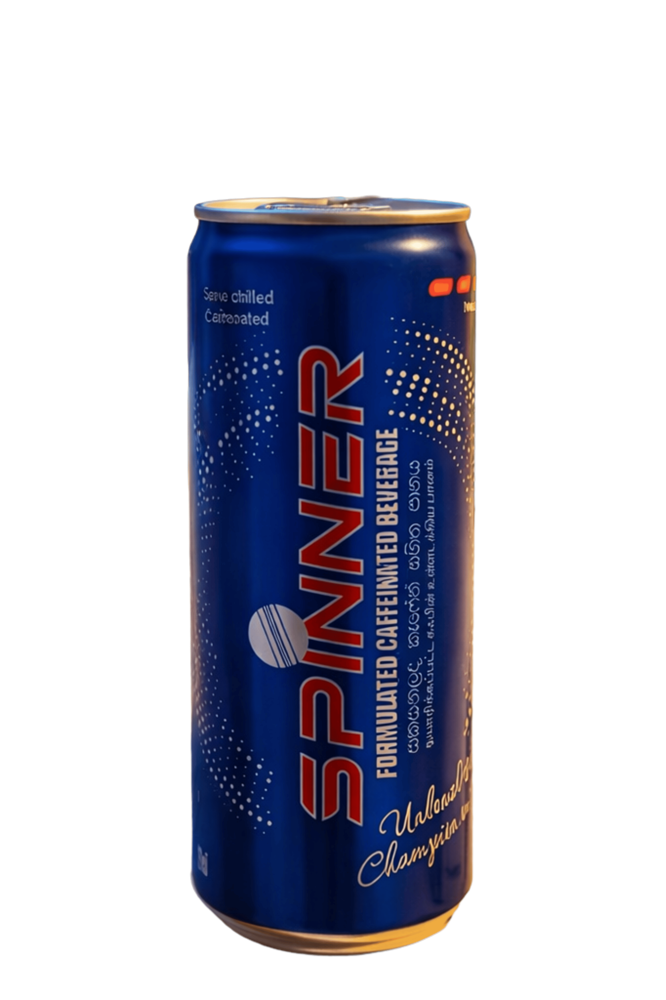

# CraftEdge - Crimson Fermentation

A modern, animated craft brewery website built with Next.js, TypeScript, and GSAP. Features smooth scroll animations, vintage aesthetics, and responsive design.



**Team**: CleverProject.lk  
**Contact**: info@cleverproject.lk  
**Repository**: [GitHub](https://github.com/thelllmike/engergydrink_animatedwebsite.git)

## 🎯 Features

- **Smooth Scroll Animations** - GSAP-powered scroll-triggered animations
- **Responsive Design** - Mobile-first approach with adaptive layouts
- **Vintage Aesthetic** - Custom typography with Veneer font and warm color palette
- **Interactive Timeline** - Animated brand history section
- **Pinned Bottle Animation** - Dynamic bottle that follows scroll with rotation effects
- **TypeScript** - Type-safe codebase
- **Next.js 16** - Latest Next.js features with App Router
- **Tailwind CSS** - Utility-first CSS framework

## 🚀 Quick Start

### Prerequisites

- Node.js 18+ 
- npm or yarn or pnpm

### Installation

1. **Clone the repository**
```bash
git clone https://github.com/thelllmike/engergydrink_animatedwebsite.git
cd engergydrink_animatedwebsite
```

2. **Install dependencies**
```bash
npm install
```

3. **Run the development server**
```bash
npm run dev
```

4. **Open your browser**
```
http://localhost:3000
```

## 📦 Project Structure

```
craftedge-nextjs/
│
├── app/
│   ├── favicon.ico
│   ├── globals.css              # Global styles
│   ├── layout.tsx               # Root layout component
│   └── page.tsx                 # Home page
│
├── components/
│   ├── Footer.js                # Footer component
│   ├── Header.js                # Header with navigation
│   ├── Hero.js                  # Hero section with bottle
│   ├── IntroSection.js          # Introduction & ingredients
│   ├── SocialSidebar.js         # Fixed social media sidebar
│   └── TimelineSection.js       # Brand timeline
│
├── hooks/
│   ├── useGSAP.js              # GSAP initialization hook
│   └── animations.js           # GSAP animation configurations
│
├── lib/
│   └── node_modules/           # Dependencies
│
├── public/
│   ├── fonts/
│   │   └── Veneer.woff         # Custom vintage font
│   └── images/
│       ├── image.png           # Main bottle image
│       ├── stamp.png           # Decorative stamp
│       ├── first batch.png     # Timeline image 1984
│       ├── file.svg            # SVG assets
│       ├── globe.svg
│       ├── next.svg
│       ├── vercel.svg
│       └── window.svg
│
├── .gitignore
├── eslint.config.mjs
├── next-env.d.ts
├── next.config.ts
├── package.json
├── package-lock.json
├── postcss.config.mjs
├── README.md
├── tsconfig.json
└── tailwind.config.ts
```

## 🎨 Design System

### Color Palette

```css
--sienna: #b1560e;        /* Primary brand orange */
--sienna-2: #92633a;      /* Secondary brown */
--white: #ffffff;
--black: #000000;
--tan: #c19f7a;           /* Border/accent color */
--papaya-whip: #eae0c7;   /* Cream background */
```

### Typography

- **Display Font**: Veneer (Custom vintage font)
- **Body Font**: Inter (Google Fonts)

### Responsive Breakpoints

- **Mobile**: `max-width: 768px`
- **Desktop**: `min-width: 769px`

## 🛠️ Tech Stack

| Technology | Purpose |
|------------|---------|
| **Next.js 16** | React framework with App Router |
| **React 19** | UI library |
| **TypeScript 5** | Type safety |
| **Tailwind CSS 4** | Utility-first styling |
| **GSAP 3.12+** | Advanced animations |
| **ScrollTrigger** | Scroll-based animations (GSAP plugin) |

## 📝 Scripts

```bash
# Development server
npm run dev

# Production build
npm run build

# Start production server
npm run start

# Run linter
npm run lint
```

## 🎬 Animation Details

### Initial Load Animations
- Header border expansion (3s)
- Navigation links slide down with stagger
- Hero heading fade-in with text-stroke transition
- Bottle wrapper scale and fade
- Stamp pop-in with elastic bounce and vibration

### Scroll-Triggered Animations
- **Hero to Intro**: Bottle rotates to 0° and scales to 0.8
- **Intro Section**: Bottle shifts right 30%, rotates to 10°
- **Timeline Entries**: Bottle alternates left/right with rotation changes

### Mobile Behavior
- Simplified animations
- No scroll-pinning (performance optimization)
- Basic fade-in effects

## 📱 Responsive Features

### Desktop (769px+)
- Fixed social sidebar (left side)
- Pinned bottle animations
- Horizontal timeline layout
- Full navigation menu

### Mobile (≤768px)
- Hamburger menu
- Bottom social bar
- Vertical timeline layout
- Simplified animations
- Touch-optimized interactions

## 🔧 Configuration Files

### `next.config.ts`
Next.js configuration including image optimization and routing

### `tailwind.config.ts`
Tailwind CSS customization with custom colors and fonts

### `tsconfig.json`
TypeScript compiler options

### `.eslintrc.json` / `eslint.config.mjs`
ESLint rules and configurations

## 🎯 Key Components

### Header.js
- Sticky navigation
- Mobile hamburger menu
- Animated border

### Hero.js
- Large typography with text-stroke effect
- Animated bottle overlay
- Decorative stamp

### IntroSection.js
- Two-column grid layout
- Ingredients list
- CTA button

### TimelineSection.js
- Alternating left/right layout
- Year + image on one side
- Story content on other side

### SocialSidebar.js
- Fixed vertical sidebar (desktop)
- Sticky bottom bar (mobile)
- Social media icons

## 🐛 Known Issues & Solutions

### TypeScript Error: `children` prop
**Error**: "Binding element 'children' implicitly has an 'any' type"

**Solution**: Type the children prop in layout.tsx
```typescript
export default function RootLayout({
  children,
}: {
  children: React.ReactNode
}) {
  // ...
}
```

## 🚀 Deployment

### Deploy to Vercel (Recommended)

1. Push your code to GitHub
2. Import project on [Vercel](https://vercel.com)
3. Configure environment variables (if any)
4. Deploy!

```bash
# Or use Vercel CLI
npm i -g vercel
vercel
```

### Deploy to Other Platforms

- **Netlify**: Connect GitHub repo
- **AWS Amplify**: Use AWS Console
- **Custom Server**: `npm run build && npm run start`

## 📄 License

This project is licensed under the MIT License - see the LICENSE file for details.

## 👤 Author

**CleverProject.lk Team**
- Website: [cleverproject.lk](https://cleverproject.lk)
- Email: info@cleverproject.lk
- GitHub: [thelllmike](https://github.com/thelllmike)

## 🙏 Acknowledgments

- GSAP by GreenSock for animation library
- Veneer font for vintage typography
- Next.js team for the amazing framework
- Inspiration from craft brewery aesthetics

## 📞 Support

For support, email info@cleverproject.lk or open an issue on GitHub.

---

**Developed by CleverProject.lk Team** 🚀  
**Built with ❤️ and craft beer** 🍺
